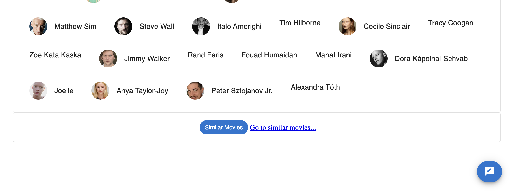

# Enterprise Web Development - Assignment 2.

__Name:__ Farhaan Kaleem

## Overview.

+ Favourite for all the types. 
+ Authentication.
+ Backend persistence.
+ Full Stack Deployment including custom domain name.
+ Themed (Day and Night).
+ Private and Public routes.
+ Pagination.
+ Caching.
+ UI - New views/pages (3+).
+ Filtering and Sorting for all types.
+ Search for all types.
+ Data Hyperlinking.
+ Display movie reviews from Dynamo DB.
+ Storybook support.

## Feature Design.

#### The Favourite Movies feature.

> Favourite Movies

#### The Favourite Actors feature.

> Favourite Actors

#### The Favourite Series feature.

> Favourite Series

## Authentication.

The application has authnetication features like signup page, confirm email page and sign in page.

When a user tries to signup, he is needed to confirm his email and then he can login. The images below demonstrate this process.

> Signup Page

> Confirm Email Page

> Receiving code in email

> Signin Page

Once the user logs in, he is redirected to home page. Authentication is required only when the user tries to access the protected routes.

## Backend Persistence

Backend Persistence means, to show the data once entered. In our application, once the user enters the review, he can always see that review, whenever he tries to see it. The reviews are stored in Dynamo DB.

> Review Page

In the image above, we can see that the last three reviews are from our DynammoDB and the remaining reviews are from TMDB. Whenever the user goes in for this movie, he will always see these reviews there, which confirms that the backend persistence is achieved.

## Full Stack Deployment including Custom Domain Name

> Custom Domain

The application is fully deployed on the cloud, The whole data for the website (backend and frontend) comes from AWS cloudfront distribution. We have the custom domain, which can be accessed by any user across the world.

Custom URL = https://movies.gotweb.site/

In the image above we can see that whenever the user accesses our custom domain url, he will be landing to our homeage.

## Themed (Day and Night)

The application has two modes or themes:

> Night mode on

> Night mode off

A small toggle button on the top right hand corner, allows the user to toggle to night or day mode.

## Private and Public Routes

Private route means the route which will be allowed only to the users who are logged in. If the user tries to access to the private route, he will be redirected to the login page.

Our application has a priavte route:

+ /movies/reviews - Eable the user to add movie reviews

If an unauthorised user tries to write a review, as this is a write operation and it's changes can be seen by the other users, this route is made private or protected. As other routes are dealing with viewing the data, other routes are public.

## Pagination

The application supports pagination, which enables the users to go across the pages and access the data they need. This feature is given for all types of data like movies, actors and series.

The header shows the page number the user is on, and using the arrows, the user can change the page numbers. Please refer the image below.

## Caching

Caching is allowed so that the page that is accessed frequently can be accessed without hitting the server again and again.

## Filtering and Sorting

For every page that lists either movies, actors or series, on the right bottom, we have a button, that allows the user to search, filter and sort the list in that page.

## Search for All Types

As the search in filtering, restricts the user to search things only in that specific page, this search empowers the user to serch for a particular movie, actor or series from this search bar. This seacrh option is avaiable to the user in the top right corner beside the mode button. 

## Data Hyperlinking

The application supports data hperlinking across the pages. We have a hamburger icoon on the top left corner of the application which enables th uesr to acess different pages accross the website. Also in the movie details page or show details page we can see the link for similar movies or similar shows. Also the actor details page has an imdb link, that allows the user to access the imdb link of that actor.

In the above image, we can also see the cast, which whenc clicked, redirects the user to that person's details. The details page of the person or actor is shown below.

## Display movie reviews from Dynamo DB

All the reviews that are persisted are loaded from the Dynamo DB. Once the user logs in, he is allowed to enter the reviews about a movie, which later can be seen by other users as well.

## Storybook Support.

Our app also gives the support to storybook, which can be used by the use to understand the application.

